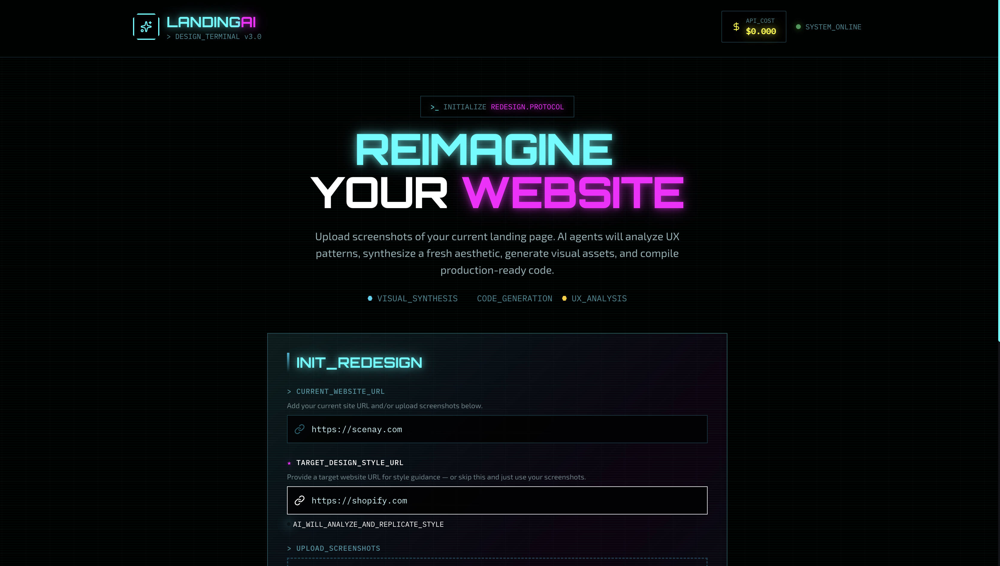

# Landing Page Redesigner AI

Redesign any landing page from screenshots or a URL, keeping the core product content while refreshing layout, visuals, and structure. It produces a new design plan, generates section visuals and code, and lets you preview or download the final HTML.

## What it does
- Extracts existing content (features, pricing, testimonials, CTAs) from your current page
- Proposes a new narrative flow and section structure
- Generates visuals and Tailwind HTML for each section
- Lets you preview and download a zip (HTML + images)

## How it works (high level)
1. Provide screenshots or a current website URL (or both)
2. Optionally provide a target style URL for visual inspiration
3. Review the redesign plan and generate assets + code

## Run locally

**Prerequisites:** Node.js and pnpm

1. Install dependencies:
   `pnpm install`
2. Set the `VITE_GEMINI_API_KEY` in `.env.local`
3. Start the app (Vite client + Express server):
   `pnpm dev`

## Project structure
- `App.tsx` / `index.tsx`: Vite + React entry and flow orchestration
- `components/`: UI blocks (input, plan review, gallery, results, stepper)
- `services/`: AI + screenshot helpers
- `server.js`: Local Express proxy (used during dev)
- `types.ts`: Shared TypeScript shapes

## Scripts
- `pnpm dev`: Run Vite client and Express server concurrently
- `pnpm build`: Production build
- `pnpm preview`: Preview the production build
- `pnpm server`: Run only the Express server

## Environment variables
- `VITE_GEMINI_API_KEY`: API key used by the client app

## Notes
- Output is Tailwind HTML assembled in the final step and downloadable as a zip.
- The redesign adapts copy but should stay faithful to original core features.
- You can configure which AI model is used at each step in `config/aiConfig.ts` (`STEPS_CONFIG`).
